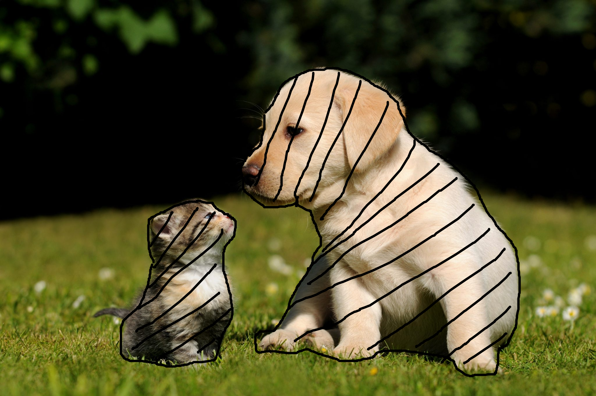

# 알고리즘

## 1. 객체 탐지

Yolonas를 이용하여 객체의 바운딩 박스를 결정합니다.


▲ Yolonas의 결과로 바운딩 박스가 결정됨

## 2. 객체 추출

원본 이미지로부터 바운딩 박스만 추출합니다.


▲ 추출된 강아지


▲ 추출된 고양이

객체 추출은 2 * 2 * 3 차원의 배열 데이터를 이용하여 수행됩니다.

2 * 2 는 이미지의 x, y 픽셀 좌표이며 3차원 배열은 각 픽셀의 RGB 값입니다.

```py
def my_function(image: list[list[list[int]]], bboxes: list[list[float]]) -> list[list[list[list[int]]]]:
    raise NotImplemented()
```

## 3. 영상 분할

추출된 바운딩 박스를 U-net이 요구하는 이미지 크기로 변환합니다.

이를 U-net의 입력으로 넣어 예측합니다.

클래스의 정보가 이미 yolonas에서 결정되었으므로

특정 픽셀이 결정된 클래스에 속하는지, 속하지 않는지를 결정하는 이진 분류 문제가 됩니다.


▲ 강아지에 해당하는 픽셀이 검정색으로 칠해졌다고 가정


▲ 고양이에 해당하는 픽셀이 검정색으로 칠해졌다고 가정

## 4. 원본 이미지에 적용

위 결과를 원본 이미지에 적용합니다.




# 참고문헌

- [Yolo 데이터 포맷](https://medium.com/red-buffer/converting-a-custom-dataset-from-coco-format-to-yolo-format-6d98a4fd43fc)